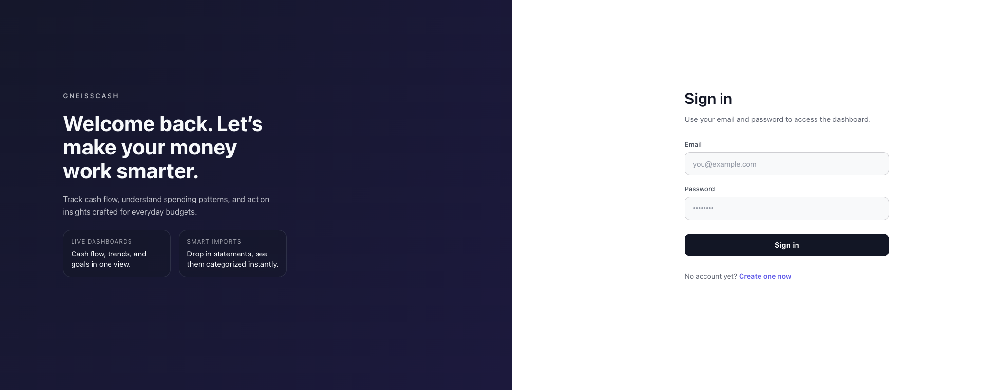

# 🪨 GneissCash

GneissCash is a cash-flow intelligence workspace for everyday budgets. Import statements, understand where money is going, and act on insights that stay live as new data lands.

## Product Highlights
- Insightful dashboards surface cash flow, spending trends, and deficit streaks in one view.
- Needs vs. wants classifier keeps budgets honest and highlights discretionary overspend.
- Fast imports accept CSV and PDF statements, normalize merchants, and auto-categorize transactions.
- Transactions workspace ships with powerful filtering, recategorization, and refresh-on-demand.
- Profiles, avatars, and goals keep shared household data human and actionable.

## Core Features
- **Cash Flow Snapshot:** 12-month view blends net, income, expenses, and rolling averages with instant KPI cards.
- **Needs vs. Wants:** Weighted scoring engine separates essentials from flex spend and ranks top discretionary categories.
- **Smart Imports:** CSV + PDF parsers (Chime-tuned) hydrate Supabase with clean transactions and source-of-truth audit trails.
- **Transactions Hub:** Category filters, metadata, and quick refresh for the latest 200 records from the import pipeline.
- **Goals & Accounts:** Manage savings goals, linked accounts, and household profile details from the settings suite.

## Tech Stack
- Next.js 16 (App Router) + React 19 + TypeScript
- Supabase (PostgreSQL, Auth, Storage) for persistence and file uploads
- Chart.js + react-chartjs-2 for cash flow, allowance, spend mix, and weekly insights
- pdf2json + custom parsers for bank statement ingestion
- CSS Modules + PostCSS for component-scoped styling

## Screenshots
Drop your latest exports in `.claude/documents/screenshots/` (or adjust the links below if you prefer a different location).




## Getting Started

### Prerequisites
- Node.js 18+
- npm (ships with Node) or pnpm/yarn if you prefer
- Supabase project (free tier works great)

### Install dependencies
```bash
npm install
```

### Environment variables
Duplicate `.env.local` (or create one) with your Supabase credentials:

```env
NEXT_PUBLIC_SUPABASE_URL=your-project-url
NEXT_PUBLIC_SUPABASE_ANON_KEY=your-anon-key
SUPABASE_SERVICE_ROLE_KEY=optional-if-running-scripts
```

If you plan to run Supabase locally, install the CLI and start the stack:

```bash
supabase start
```

### Run the app
```bash
npm run dev
```

Visit `http://localhost:3000` to explore the dashboard.

## Database & Imports
- Supabase migrations live in `supabase/migrations/` and can be applied with `supabase db reset` or `supabase db push`.
- Statement ingestion flows through `src/lib/parsers/` and the associated API routes in `src/app/api/import/` and `src/app/api/transactions/`.
- Spend-mix analytics logic lives in `src/lib/analytics/`.

## Classifier Accuracy
- Prepare a labeled CSV that mirrors parsed transactions and add an `expected_class` column with `essential` or `flex` for every row (negative amounts should represent expenses).
- Run the evaluator: `npm run spendmix:test -- --file path/to/labeled.csv`
- Optional: append `--errors reports/mismatches.csv` to write every disagreement between the labels and the classifier.
- The script reports accuracy, precision/recall per class, and exports misclassifications for fast rule tuning.

## Roadmap Notes
- Automated e2e and parser regression tests
- CI/CD hardening before production launch
- Manual overrides for edge-case categorization

Contributions, critiques, and UI polish ideas are always welcome.
